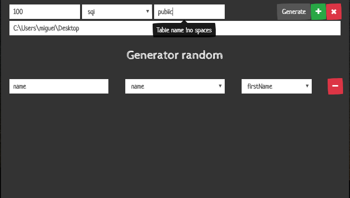

# Faker generator

This is a app builded in vuejs with electron.

This is a one form easy to create data to **.svg, .json, .sql, .txt**

### If you want to try!

you need nodejs >12 & yarn >1.20

downlod this repo and execute

``
yarn
``

``
yarn start
``

or if you want to install execute

``
yarn
``

``
yarn dist
``

This application was created with **[Faker js](https://github.com/marak/Faker.js/)**
